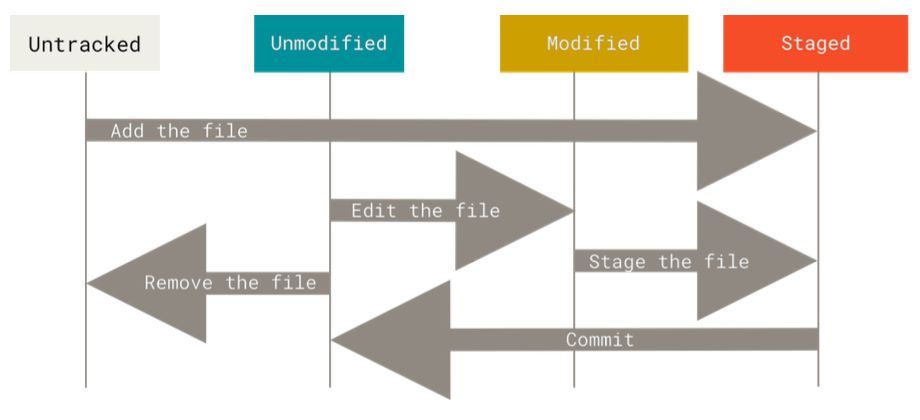

# Git Basics

This file contains information that I find important in order to understand and familiarize myself with Git. It includes commands, features, and additional information that makes it easy for me to reference as I progress.

# Table of Contents
- [Git Setup](https://github.com/carloscaguana/test-repo/blob/main/gitBasics.md#git-setup)
- [Getting Help with Commands](https://github.com/carloscaguana/test-repo/blob/main/gitBasics.md#getting-help-with-commands)
- [Getting a Git Repository](https://github.com/carloscaguana/test-repo/blob/main/gitBasics.md#getting-a-git-repository)
  - [Initializing a Repository in an Existing Directory](https://github.com/carloscaguana/test-repo/blob/main/gitBasics.md#option-1-initializing-a-repository-in-an-existing-directory)
  - [Cloning an Existing Repository](https://github.com/carloscaguana/test-repo/blob/main/gitBasics.md#option-2-cloning-an-existing-repository)
- [Recording Changes to the Repository](https://github.com/carloscaguana/test-repo/blob/main/gitBasics.md#recording-changes-to-the-repository)
  - [Checking the Status of Your Files](https://github.com/carloscaguana/test-repo/blob/main/gitBasics.md#checking-the-status-of-your-files)
  - [Tracking New Files](https://github.com/carloscaguana/test-repo/blob/main/gitBasics.md#tracking-new-files)
  - [Staging Modified Files](https://github.com/carloscaguana/test-repo/blob/main/gitBasics.md#staging-modified-files)
  - [Short Status](https://github.com/carloscaguana/test-repo/blob/main/gitBasics.md#short-status)
  - [Ignoring Files](https://github.com/carloscaguana/test-repo/blob/main/gitBasics.md#ignoring-files)
  - [Viewing Your Staged and Unstaged Changes](https://github.com/carloscaguana/test-repo/blob/main/gitBasics.md#viewing-your-staged-and-unstaged-changes)
  - [Committing your Changes](https://github.com/carloscaguana/test-repo/blob/main/gitBasics.md#committing-your-changes)
  - [Skipping the Staging Area](https://github.com/carloscaguana/test-repo/blob/main/gitBasics.md#skipping-the-staging-area)
  - [Removing Files](https://github.com/carloscaguana/test-repo/blob/main/gitBasics.md#removing-files)
  - [Moving Files](https://github.com/carloscaguana/test-repo/blob/main/gitBasics.md#moving-files)
- [Viewing the Commit History](https://github.com/carloscaguana/test-repo/blob/main/gitBasics.md#viewing-the-commit-history)
  - [Limiting Log Output](https://github.com/carloscaguana/test-repo/blob/main/gitBasics.md#limiting-log-output)
- [Undoing Things](https://github.com/carloscaguana/test-repo/blob/main/gitBasics.md#undoing-things)
  - [Unstaging a Staged File](https://github.com/carloscaguana/test-repo/blob/main/gitBasics.md#unstaging-a-staged-file)
  - [Unmodifying a Modified File](https://github.com/carloscaguana/test-repo/blob/main/gitBasics.md#unmodifying-a-modified-file)
- [Working with Remotes](https://github.com/carloscaguana/test-repo/blob/main/gitBasics.md#working-with-remotes)
  - [Showing your Remotes](https://github.com/carloscaguana/test-repo/blob/main/gitBasics.md#showing-your-remotes)
  - [Adding Remote Repositories](https://github.com/carloscaguana/test-repo/blob/main/gitBasics.md#adding-remote-repositories)
  - [Fetching/Pulling from Your Remotes](https://github.com/carloscaguana/test-repo/blob/main/gitBasics.md#fetchingpulling-from-your-remotes)
  - [Pushing to Your Remotes](https://github.com/carloscaguana/test-repo/blob/main/gitBasics.md#pushing-to-your-remotes)
  - [Inspecting a Remote](https://github.com/carloscaguana/test-repo/blob/main/gitBasics.md#inspecting-a-remote)
  - [Renaming and Removing Remotes](https://github.com/carloscaguana/test-repo/blob/main/gitBasics.md#renaming-and-removing-remotes)
- [Tagging](https://github.com/carloscaguana/test-repo/blob/main/gitBasics.md#tagging)
  - [Listing Your Tags](https://github.com/carloscaguana/test-repo/blob/main/gitBasics.md#listing-your-tags)
  - [Creating Tags](https://github.com/carloscaguana/test-repo/blob/main/gitBasics.md#creating-tags)
    - [Annotated Tags](https://github.com/carloscaguana/test-repo/blob/main/gitBasics.md#annotated-tags)
    - [Lightweight Tags](https://github.com/carloscaguana/test-repo/blob/main/gitBasics.md#lightweight-tags)
  - [Tagging Later](https://github.com/carloscaguana/test-repo/blob/main/gitBasics.md#tagging-later)
  - [Showing Tag Info](https://github.com/carloscaguana/test-repo/blob/main/gitBasics.md#showing-tag-info)
  - [Sharing Tags](https://github.com/carloscaguana/test-repo/blob/main/gitBasics.md#sharing-tags)
  - [Deleting Tags](https://github.com/carloscaguana/test-repo/blob/main/gitBasics.md#deleting-tags)
- [Git Aliases](https://github.com/carloscaguana/test-repo/blob/main/gitBasics.md#git-aliases)

## Git Setup

`git config`

Lets you get and set configuration variables to customize your git environment.
Here are some flags that can be used with `git config`:

- `--global`: specifies that the configuration should be applied globally across all of your Git repositories on your system.
- `--local` or `--repository`: Sets the configuration for the current repository only. This overrides any global configuration for that specific repository.
- `--system`: Sets the configuration system-wide for all users on the system. This typically requires administrative privileges.
- `--get`: Retrieves the value of a specific configuration key.
- `--unset`: Removes a specific configuration key.
- `--unset-all`: Removes all values associated with a specific configuration key.
- `--list`: Lists all the configuration settings for the current repository or globally, depending on the context.

<ins>Ex.</ins> `git config --global user.name "John Doe"` sets the value of user.name to 'John Doe.'

`git config user.name`

Displays the user's name/username

`git config user.email`

Displays the user's email

`git config --list`

Displays list of your configuration variables for git on your local system

`git config <key>`

Used to check a specific value for the given key

## Getting Help with Commands
There are 3 ways to get information from manual pages (manpage) while using Git:

`git <verb> -h`

`git help <verb>`

`git <verb> --help`

The first command will give you a short, concise version of the manpage that will appear in the Terminal (Mac) or in Git Bash (Windows). This command is good if you want to reference something real quick because you forgot.

The last two commands will give you a more extensive version of the manpage that includes even more information. If you're on Mac, this extensive version can be accessed through the Terminal. You can exit by pressing the 'Q' button. On Windows, it will open up a new window on your  browser with all the information.

## Getting a Git Repository
There are 2 ways of getting a Git repository:

1. You can take a local directory that isn't under version control and turn it into a Git repository
2. You can clone an existing Git repository from Github onto your local device

### Option 1: Initializing a Repository in an Existing Directory
If you have an existing directory that isn't under version control, you can do so by first moving to that directory.

For MacOS:
`$ cd /Users/user/my_project`

For Windows: 
`$ cd C:/Users/user/my_project`

Once you find yourself in the desired directory, you want to type the following command:

`$ git init`

The command *init* is short for <u>initialize</u>. This creates a subirectory named `.git` which contains all repository files necessary to create a Git repository skeleton. It is important to note that at this point, nothing in the directory is tracked yet. 

### Option 2: Cloning an Existing Repository
To get a copy of a Git repository that already exists on GitHub, you simply use the command:

`git clone <url>`

To find the URL of the repository you want to clone:
1. Log in to GitHub.com
2. Find the repository you want to clone
3. Press on the green button that says 'Code'
4. Copy the HTTPS web URL
5. Paste the web URL into the terminal

The information in the URL would look something like this:

`https://github.com/username/repository-name`

When you create this clone on your local device, it creates a directory named `repository-name`, initializes a `.git` subdirectory inside it, pulls all the data from the repository, and checks out a working copy of the latest version.

You can also clone the repository into a directory with a different name:

`git clone <url> new-filename`

## Recording Changes to the Repository
Each file in your working directory can be in one of two states: tracked or untracked. Tracked files are files that Git knows about while untracked files are files that Git is unaware of. 

### Checking the Status of your Files
To check the status of the files in your working directory, you can use the following command:

`git status`

This command tells the user what branch they are one (usually *'main'*), as well as the state of the files in that working directory.

### Tracking New Files

To begin tracking a new file, you can use this command:

`git add <filename>`

This means that the file is tracked and staged, ready to be commited.

### Staging Modified Files
To stage a file that is unstaged, you simply use the `git add` command. This multipurpose command can be used to track new files and stage files.

Suppose you've already staged a file and you are ready to commit. However, you remember a small detail in that file that you want to change so you do so. If you were to run the `git status` command after that minor change, you would see that the file appears both as staged and unstaged.

This is because when you modified the file after staging it, the changes made to the file are unstaged. You would have to run the `git add` command again in order to stage the latest version of the file you're working on.

### Short Status

To see your changes in a more simplified way, you can simply run the following command:

`git status -s` or `git status --short`

`??`: means the file is not being tracked

`A`: the file has been added to the staging area

`M`: the file has been modified

### Ignoring Files

There are certain files you want to keep hidden, like log files or files created by your OS. You can add them to a `.gitignore` file so that these files aren't commited to the Git repository.

`#` functions like the `//` in Java. The line is not read and acts like a line to write comments.

### Viewing Your Staged and Unstaged Changes
If you want to know exactly what was changed in a file, you can use the command: 

`git diff`

It tells you the changes you've made that you havent staged yet. This command will give you no output if you've staged your changes.

`git diff --staged`
`git diff --cached`

This command compares your staged changes to your last commit. Use this command to see what you've staged that will go into your next commit.

### Committing your Changes
To commit changes that are staged, you use the following command: 

`git commit`

This command will open the an editor (usually vim or emacs) where the user can write the desired commit message. A faster way to commit without opening up an editor is by using the command:

`git commit -m "message"`

### Skipping the Staging Area

`git commit -a -m "message"`

This command can be used to skip the staging area. By doing so, all the tracked files that have been changed are automatically staged and committed. The `-a` flag might include unwanted changes to your commit.

### Removing Files
Before removing a file from Git, the file you want to remove has to be unstaged. To remove a file, use the command: 

`git rm <file>`

This command removes the file from the working directory and deletes it from the directory. 

If the file is staged or has been modified, you can still remove it from the directory using this command:

`git rm -f <file>`

This forces a removal of a file. 

`git rm --cached <file>`

You can pass files, directories, and file-golb patterns to these commands. Search 'file glob patterns.'

### Moving Files

Git doesn't track file movement. Instead, it renames them. Use the following command to rename a file:

`git mv <oldFileName> <newFileName>`

## Viewing the Commit History
To see all the commits you've done, the simplest command you could use is: 

`git log`

This command lists the commits in reverse chronilogical order, meaning that the most recent commit will appear at the top.

To quickly view the latest commit made, you can use the command:

`git log -1`

Another useful option is `-p` or `--patch` which shows the difference introduced in each commit.
`git log --stat`

This command prints out each commit entry, a list of modified files, how many files were changed, and how many lines in those files were added/removed. A summary is also included at the end. 

`git log --pretty`

This command changes the log output to different formats compared to the default. You can use different option values

`git log --pretty=oneline`

`git log --pretty=short`

`git log --pretty=full`

`git log --pretty=fuller`

`git log ==pretty=format`

The `format` option value lets you customize the log output format. A list of specifiers to use after `format:`

You can also use the option `--graph` which shows a graph showing your branch and merge history. It's really useful with `oneline` and `format` option values.

### Limiting Log Output

There are useful limiting options when using `git log`, one of them being the `-<n>` option. `n` can be any interger and it will show you the last `n` commits.

`git log --since=<specific date>` or `git log --until=<relative date>`

You could also use time-limiting options such as `--since` and `until` which works with a lot of formats. You can enter a specific date like `2022-04-19`, or a relative date like `1 year 43 days 2 hours ago`.

## Undoing Things

While using Git, you might realize that you want to undo something. If you commit too early and you forgot to add files or want to change your commit message, you can redo the commit by using the command:

`git commit --amend`

It takes you to the staging area and uses it for the commit. This also opens up the commit-message editor with your previous commit message. Here, you can edit the message.

`git commit --amend -m "message"`

If the commit-message editor doesn't work for whatever reason, you could use the command above to change the commit message.

### Unstaging a Staged File

`git reset HEAD <file>`

`git restore --staged <file>`

The command above makes it so that the staged file becomes unstaged. Any changes made to the file are still there, meaning any changes that were made don't disappear.

### Unmodifying a Modified File

`git checkout -- <file>`

`git restore <file>`

Acts sort of like an 'undo' button. It reverts the changes made to the file to what it was when you made the last commit. Can only be used on unstaged files.

## Working with Remotes

To collaborate on Git projects, it's ideal to know how to manage your remote repositories which are projects hosted on the Internet or network somewhere. 

### Showing your Remotes

`git remote`

This command lists the remote servers you have configured. You should at least see `origin` if you've cloned your repo. 

`git remote -v`

This command shows the URLs that Git has stored for the shortname that's used when reading/writing to the remote. This command lists all the remotes if you have more than one. 

### Adding Remote Repositories

`git remote add <shortname> <url>`

This command adds a new remote explicitly. You can use the string `<shortname>` on the command line instead of the URL.

### Fetching/Pulling from Your Remotes

`git fetch <remote>`

This command obtains data from your remote projects. It fetches any new work that has been pushed to the server since you cloned it. This command ONLY downloads data to your local repository; it doesn't merge it with any other work you're working on. 

`git pull`

Automatically fetches and merges the remote branch into your current branch. 

### Pushing to Your Remotes

When you have a project to a point where you want to share it, you have to push it upstream. Us this command:

`git push <remote> <branch>`

<ins>Ex.</ins> your branch would be `main` and your remote would be `origin`. This command works only if you've cloned from a server to which you have write access and nobody has pushed in the meantime. 

### Inspecting a Remote
 
 `git remote show <remote>`

This command displays the URL for the remote repo, as well as the tracking branch info. It also lists all the remote references it has pulled down.

### Renaming and Removing Remotes

`git remote rename <old-name> <new-name>`

This command changes a remote's shortname. This also changes all your remote-tracking branch names. 

`git remote remove <remote-name>`

This command deletes all remote-tracking branches and configuration settings associated with that remote.

## Tagging

Git has the ability to tag specific points in a repo's history as being important. People use this function to mark release points (version types).

### Listing Your Tags

`git tag`

This command lists the tags in alphabetical order. You can also use this same command with the optional `-l` or `--list` at the end. 

You can also search for tags that match a specific pattern by using widlcards. It's important to keep in mind that if you are using a wildcard, you are required to use either `-l` or `--list`. For example:

`git tag -l "v1.8.5*"`

### Creating Tags

There are two types of tags in Git: 'lightweight' and 'annotated.'

**Lightweight:** is like a branch that doesn't change. It is essentially a pointer to a specific commit. 

**Annotated:** are stored as full objects in the Git database. They contain tagger name, email, and date; have a tagging message, can be signed and verified with GNU Privacy Guard.

### Annotated Tags

`git tag -a <tagname> -m "message"`

This command can be used to create an annotated tag. if you don't include `-m`, Git will automatically open your editor so you can type the message.

### Lightweight Tags

A lightweight tag is basically the commit checksum (also called a hash) stored in a file. To create a lightweight tag, don't supply any of the `-a`, `-s`, or `-m` options. Just proivde a tagname:

`git tag <tagname>`

A difference between an annotated tag and a lightweight tag is that the latter doesn't show any tagger info, it simply just displays the commit info. 

### Tagging Later

You can tag previous commits. All you have to do is specify the commit checksum (or part of it) at the end of the command:

`git tag -a <tagname> <checksum>`

### Showing Tag Info
To see detailed info about a specific tag, use the command: 

`git show <tagname>`

This command shows the tagger info and everything related to it before showing the commit info.

### Sharing Tags

You have to explicitly push tags to a shared server after you've created them. 

`git push <remote-name> <tagname>`

If you have a lot of tags you want to push up at once, you can use the `--tags` option. This will transfer all the tags to the remote server that aren't already there (the `remote-name` is usually `origin`):

`git push <remote-name> --tags`

### Deleting Tags

To delete tags on your local repo, use the following command:

`git tag -d <tagname>`

Keep in mind this doesn't delete the tag from any remote servers. There are two ways to remove tags from a remote server:

`git push <remote> :refs/tags/<tagname>`

`git push <remote> --delete <tagname>`

The second option is more intuitive and you should use it.

## Git Aliases

There's a feature that makes it simpler and easier to use Git called aliases. You can create shortcuts for Git commands. Examples of useful Git aliases:

`git config --global alias.co checkout`

`git config --global alias.br branch`

`git config --global alias.ci commit`

`git config --global alias.st status`

So instead of typing `git status`, you just need to type `git st`. You can use aliases to create shortcuts for almost anything!

Another useful alias for unstaging files in Git:

`git config --global alias.unstage 'reset HEAD --'`

This makes the following two commands the same: 

`git unstage file1`

`git reset HEAD -- file1`

It's also common to add a  `last` command, which allows you to view the most recent commit:

`git config --global alias.last 'log -1 HEAD'`

# Git Branching

Branching is when you diverge from the main line of development to continue to do work without messing with the main line. Git's branching is lightweight when compared to other version control systems (VCS).

# Table of Contents

- [Branches in a Nutshell](https://github.com/carloscaguana/test-repo/blob/main/gitBasics.md#branches-in-a-nutshell)
  - [Creating a New Branch](https://github.com/carloscaguana/test-repo/blob/main/gitBasics.md#creating-a-new-branch)
  - [Switching Branches](https://github.com/carloscaguana/test-repo/blob/main/gitBasics.md#switching-branches)
- [Basic Branching and Merging](https://github.com/carloscaguana/test-repo/blob/main/gitBasics.md#basic-branching-and-merging)
  - [Basic Branching](https://github.com/carloscaguana/test-repo/blob/main/gitBasics.md#basic-branching)
  - [Basic Merging](https://github.com/carloscaguana/test-repo/blob/main/gitBasics.md#basic-merging)
  - [Deleting Branches](https://github.com/carloscaguana/test-repo/blob/main/gitBasics.md#deleting-branches)
  - [Basic Merge Conflicts](https://github.com/carloscaguana/test-repo/blob/main/gitBasics.md#basic-merge-conflicts)

## Branches in a Nutshell

Git stores its data as a series of snapshots. When a user makes a commit, Git stores a commit object that contains a pointer to the snapshot of the content you staged. 

Assume you have a directory containing 3 files, you stage them all and commit.

- Staging the files computes a checksum for each file (SHA-1)
- It then stores that version of the file in the Git repository (Git refers to them as blobs)
- Finally, it adds that checksum to the staging area.

Your Git repo now contains 5 objects: <ins>3 blobs</ins> (each representing the contents of one of the three files), <ins>1 tree</ins> that lists the contents of the directory and specifies which files are stored as which blobs, and <ins>1 commit</ins> with the pointer to that root tree and al the commit metadata.

 

When you make another commit, it stores a pointer to the commit that came immediately before it, a linked list!

A branch in Git is simply a pointer to one of these commits (snapshots). The default branch name is either `master` or `main`. Much like the way a linked list functions, whenever you add a new object to the list (in this case, when you make a commit) the branch pointer moves forward automatically to the new commit. This new commit object points to the previous object that came before it, its parent. 

### Creating a New Branch

When you create a new branch, you're basically creating a new pointer that you can move around. In order to create a new branch, use the following command:

`git branch <branch-name>`

This creates a new pointer to the commit you're currently on. You want to make sure that you're repo doesn't have any uncommited changes before creating a new branch to avoid any conflicts. Keep in mind, this command only creates a new branch it DOES NOT move you to that new branch.

Git has a special pointer called `HEAD` that points to the branch you're currently on. 

To view which branch `HEAD` is pointing to, use the following command:

`git log --oneline --decorate`

Using this command allows you to view to which branch pointer `HEAD` is pointing to, as well as all the branches corresponding to the checksum identifier for the current commit.

### Switching Branches

To switch to an existing branch, you run the following command:

 `git checkout <branch-name>`

This moves the `HEAD` to point to the `branch-name` branch, in this case `testing`:

If you were to make a commit, it would look something like this:

The `testing` branch has moved forward while the `master` branch points to a previous commit. Switching back to the `master` branch:

Moving back to the `master` branch does two things:

- It moved `HEAD` pointer back to point to the `master` branch.
- It reverted the files in your working directory back to the snapshot that `master` points to (Almost like a rewind).

Keep in mind, any changes made in this branch will diverge away from the `testing` branch. Basically these changes are isolated in seperate branches. You can merge them together once you're ready

A branch in Git is just a file that contains a 40-character SHA-1 checksum of the commit it points to. This makes creating branches cheap to create/destroy. Other important commands:

`git checkout -b <new-branch-name>`

Lets you create a new branch and switch to it at the same time.

## Basic Branching and Merging

Example of a workflow procedure:

1. Do some work on a website.
2. Create a branch for a new user story you're working on.
3. Do some work in that branch.

You might be asked to fix an issue with the website and you'll need a hotfix:

1. Switch to your production branch.
2. Create a branch to add the hotfix.
3. After it's tested, merge the hotfix branch, and push to production.
4. Switch back to your original user story and continue working

### Basic Branching

`git checkout -b <branch-name>`

This command creates a branch and switches to it at the same time.

REMEMBER: Git won't let you switch branches if you have uncommitted changes in your staging area or working directory. Make sure there is nothing pending before switching branches.

Simple commit history.

Creates a new branch pointer called `iss53`.

Work on new branch and it moves forward.

New issue with `master` branch. Moves to `master` and creates new branch called `hotfix`. Work is done on `hotfix`,moving it forward.

Merges `hotfix` branch into `master`. Since 'C4' (where the `hotfix` branch pointer is)
is directly ahead of 'C2' (where `master` branch pointer is), Git simply moves the `master` pointer forward. This is known as a 'fast-forward'.

Switches back to `iss53` branch and continues working.

### Basic Merging

When you're ready to merge into your main branch, you want to make sure that you check out the branch that you want to merge into and run the command:

`git merge <branch-name>`

Using the same example as before, say you're ready to merge `iss53` into the `master` branch. Simply use the `merge` command. In this case, Git finds the common ancestor of the two commits you want to merge, and the two commits themselves to create a new snapshot.

The new snapshot that is a result from this 3-way merge is used to create a new commit that points to it, referred to as a 'merge commit' which has more than one parent as seen in the image.

### Deleting Branches

If you are no longer using a branch, you can use the following command to delete it:

`git branch -d <branch-name>`

### Basic Merge Conflicts

There will be conflicts between branches when you change the same part of a file on both branches you want to merge. Instead of merging, Git will pause the merge and prompt the user to fix the issue before proceeding. 

Use `git status` to view which files are unmerged. Anything that has merge conflicts will be listed as 'unmerged.' Git adds standard conflict resolution markers to the files that have conflicts which would look something like this:

>`<<<<<<< HEAD: CONTENTS OF CONFLICTS IN BRANCH YOU WANT TO MERGE INTO (USUALLY MAIN)`
>
> `=======`
>
> `CONFLICTS IN BRANCH THAT'S BEING MERGED >>>>>>>`

In order to solve these conflicts, you could either choose to keep one of the sides or change the entire contents of the conflicts by removing the `<,=,>` markers.

After resolving these sections, you want to stage the files by using the `git add` command to mark it as resolved.

Run `git status` command to ensure that all conflicts have been resolved. Once you're content with the files, run `git commit` to finalize the merge commit.

## Branch Management

The `*` character you see when you run the `git branch` command indicates the current branch you are on (i.e. the branch that `HEAD` points to).

`git branch -v`

This command displays the last commit on each branch.

`git branch --merged`

This command filters the list of branches that you have merged into the branch you're currently on.

`git branch --no-merged`

This command filters the list of branches that you have not yet merged into the current branch.

### Changing a Branch Name

When working in teams, you SHOULD NOT rename branches that are still being used by collaborators.

`git branch --move <old-branch-name> <new-branch-name>`

This command will change the name of the branch LOCALLY. In order to let other collaborators see the new branch name on the remote, use the command:

`git push --set-upstream origin <new-branch-name>`

If you run the `git branch --all` command after changing the name of a branch, you will notice that the old branch name still appears. To delete this, use the command:

`git push origin --delete <old-branch-name>`

## Branching Workflows

**PAGE LEFT OFF ON: 82**

**Create link to TOC for 'Git Branching' and other headings added**

**Try creating a branch to work on a chapter until the entire chapter is completed. Then after it is complete, merge.**
